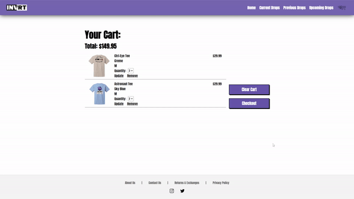

<a name="readme-top"></a>

<!-- PROJECT LOGO -->
<div align="center">
  <a href="https://github.com/LexCarey/invrt">
    
  </a>

<h3 align="center">INVRT</h3>

  <p align="center">
    INVRT is a fully operational E-Commerce clothing website.
    <br />
    <a href="https://github.com/LexCarey/invrt"><strong>Explore the docs »</strong></a>
    <br />
    <br />
    <a href="https://invrtofficial.com/">Live Site</a>
    ·
    <a href="https://github.com/LexCarey/invrt/issues">Report Bug</a>
    ·
    <a href="https://github.com/LexCarey/invrt/issues">Request Feature</a>
  </p>
</div>


<!-- TABLE OF CONTENTS -->
<details>
  <summary>Table of Contents</summary>
  <ol>
    <li>
      <a href="#about-the-project">About The Project</a>
      <ul>
        <li><a href="#built-with">Built With</a></li>
      </ul>
    </li>
    <li>
      <a href="#getting-started">Getting Started</a>
      <ul>
        <li><a href="#prerequisites">Prerequisites</a></li>
        <li><a href="#installation">Installation</a></li>
      </ul>
    </li>
    <li><a href="#demos">Demos</a></li>
    <li><a href="#roadmap">Roadmap</a></li>
    <li><a href="#contact">Contact</a></li>
  </ol>
</details>


<!-- ABOUT THE PROJECT -->
## About The Project
Invrt is a bay area clothing brand designed by one of my closest friends, Alex Brodeur. I created this website to give his brand the ability to expand into the online market. Anybody can visit the site and purchase an item (as long as it's in stock!). 


### Built With

* Python
* Flask
* Jinja2
* SQL
* Stripe API

<p align="right">(<a href="#readme-top">back to top</a>)</p>


<!-- GETTING STARTED -->
## Getting Started

This is an example of how you may give instructions on setting up your project locally.
To get a local copy up and running follow these simple example steps.

### Prerequisites

This is an example of how to list things you need to use the software and how to install them.
* npm
  ```sh
  npm install npm@latest -g
  ```

### Installation

1. Get a free API Key at [https://example.com](https://example.com)
2. Clone the repo
   ```sh
   git clone https://github.com/LexCarey/invrt.git
   ```
3. Install NPM packages
   ```sh
   npm install
   ```
4. Enter your API in `config.js`
   ```js
   const API_KEY = 'ENTER YOUR API';
   ```

<p align="right">(<a href="#readme-top">back to top</a>)</p>


<!-- DEMOS EXAMPLES -->
## Demos

### Adding to cart:


### Checking out:



_You can check out the site here if you would like to test any features for yourself: [Live Site](https://invrtofficial.com/)_

<p align="right">(<a href="#readme-top">back to top</a>)</p>


<!-- ROADMAP -->
## Roadmap

- [ ] Create a more inviting & interactive home page.
- [ ] Update "Current Drop" tab to "Current Drops" tab, letting all in stock drops show up instead of just the most recent drop.
- [ ] Show that a product is soldout on the drop tab instead of just the individual product page.
- [ ] Add support for more clothing items:
    - [ ] Hats

See the [open issues](https://github.com/LexCarey/invrt/issues) for a full list of proposed features (and known issues).

<p align="right">(<a href="#readme-top">back to top</a>)</p>


<!-- CONTACT -->
## Contact

Lexington Carey - [@AkuaDrowned](https://twitter.com/AkuaDrowned) - lexcarey73@gmail.com

Project Link: [https://github.com/LexCarey/invrt](https://github.com/LexCarey/invrt)

Live Link: [https://invrtofficial.com/](https://invrtofficial.com/)

<p align="right">(<a href="#readme-top">back to top</a>)</p>
