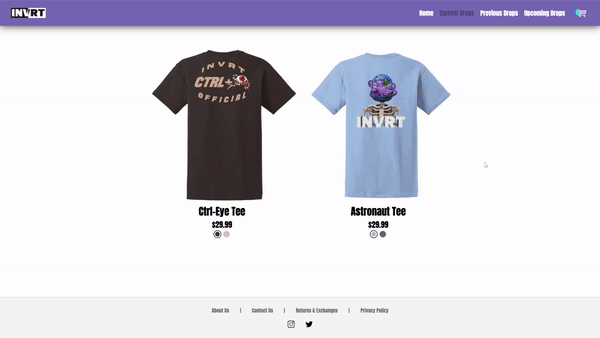

<a name="readme-top"></a>

<!-- PROJECT LOGO -->
<div align="center">
  <a href="https://github.com/LexCarey/invrt">
    
  </a>

<h3 align="center">INVRT</h3>

  <p align="center">
    INVRT is a fully operational E-Commerce clothing website.
    <br />
    <a href="https://github.com/LexCarey/invrt"><strong>Explore the docs »</strong></a>
    <br />
    <br />
    <a href="https://invrtofficial.com/">Live Site</a>
    ·
    <a href="https://github.com/LexCarey/invrt/issues">Report Bug</a>
    ·
    <a href="https://github.com/LexCarey/invrt/issues">Request Feature</a>
  </p>
</div>


<!-- TABLE OF CONTENTS -->
<details>
  <summary>Table of Contents</summary>
  <ol>
    <li>
      <a href="#about-the-project">About The Project</a>
      <ul>
        <li><a href="#built-with">Built With</a></li>
      </ul>
    </li>
    <li>
      <a href="#getting-started">Getting Started</a>
      <ul>
        <li><a href="#prerequisites">Prerequisites</a></li>
        <li><a href="#installation">Installation</a></li>
      </ul>
    </li>
    <li><a href="#demos">Demos</a></li>
    <li><a href="#roadmap">Roadmap</a></li>
    <li><a href="#contact">Contact</a></li>
  </ol>
</details>


<!-- ABOUT THE PROJECT -->
## About The Project
Invrt is a bay area clothing brand designed by one of my closest friends, Alex Brodeur. I created this website to give his brand the ability to expand into the online market. Anybody can visit the site and purchase an item (as long as it's in stock!). 

### Built With

* [Python](https://www.python.org/)
* [Flask](https://flask.palletsprojects.com/en/2.2.x/)
* [Jinja2](https://jinja.palletsprojects.com/en/3.1.x/)
* [MySQL](https://www.mysql.com/)
* [Stripe API](https://stripe.com/)

<p align="right">(<a href="#readme-top">back to top</a>)</p>


<!-- GETTING STARTED -->
## Getting Started

Important: Most features require an exact copy of my database structure (which I don't have publically available), meaning a majority of the functions will not work on your local copy. I reccomend checking out the <a href="https://invrtofficial.com/">live site</a> if you'd like to see everything in action.

If you would still like to run a local copy, you can follow the steps below.

### Prerequisites

* Python

  [Python Download](https://www.python.org/downloads/)

* Flask
  ```sh
  pip install Flask
  ```
  
* Jinja2
  ```sh
  pip install Jinja2
  ```
  
* Repo
   ```sh
   git clone https://github.com/LexCarey/invrt.git
   ```

### Stripe Install

1. Get 2 free API Keys (public and secret) at [https://stripe.com](https://stripe.com/)
2. Create file `creds.py` in folder `flask_app`
   ```sh
   cd flask_app
   type nul > creds.py
   ```
3. Enter your API keys in `creds.py`
   ```py
   STRIPE_PUBLIC_KEY = 'ENTER YOUR PUBLIC API KEY'
   STRIPE_SECRET_KEY = 'ENTER YOUR SECRET API KEY'
   ```
   
### Run Project

1. Navigate to folder `invrt`
2. Open shell
   ```sh
   pipenv shell
   ```
   **OR**
   
   ```sh
   py -m pipenv shell
   ```
3. Run file `server.py`
   ```sh
   py server.py
   ```

<p align="right">(<a href="#readme-top">back to top</a>)</p>


<!-- DEMOS EXAMPLES -->
## Demos

### Browsing Items:



### Adding to Cart:


### Checking out:


_You can check out the site here if you would like to test any features for yourself: [Live Site](https://invrtofficial.com/)_

<p align="right">(<a href="#readme-top">back to top</a>)</p>


<!-- ROADMAP -->
## Roadmap

- [x] Complete user checkout flow.
- [x] Add support tabs (About, Contact, Returns, Privacy Policy)
- [ ] Create a more inviting & interactive home page.
- [ ] Update "Current Drop" tab to "Current Drops" tab, letting all in stock drops show up instead of just the most recent drop.
- [ ] Show that a product is soldout on the drop tab instead of just the individual product page.
- [ ] Add support for more clothing items:
    - [ ] Hats

See the [open issues](https://github.com/LexCarey/invrt/issues) for a full list of proposed features (and known issues).

<p align="right">(<a href="#readme-top">back to top</a>)</p>


<!-- CONTACT -->
## Contact

Lexington Carey - [@AkuaDrowned](https://twitter.com/AkuaDrowned) - [LinkedIn](https://www.linkedin.com/in/lexington-carey/) - lexcarey73@gmail.com

Project Link: [https://github.com/LexCarey/invrt](https://github.com/LexCarey/invrt)

Live Link: [https://invrtofficial.com/](https://invrtofficial.com/)

<p align="right">(<a href="#readme-top">back to top</a>)</p>
